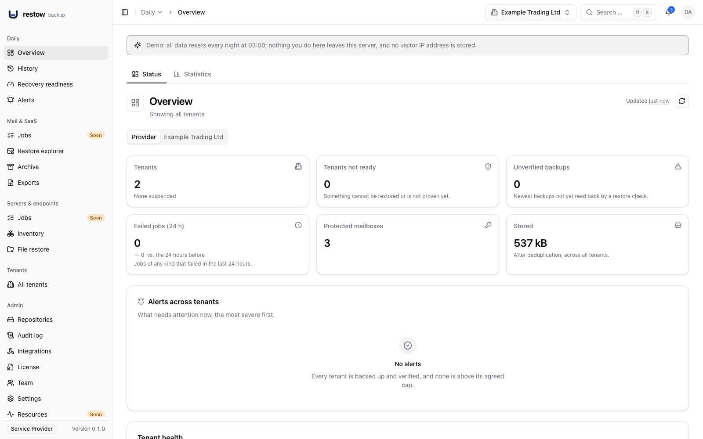
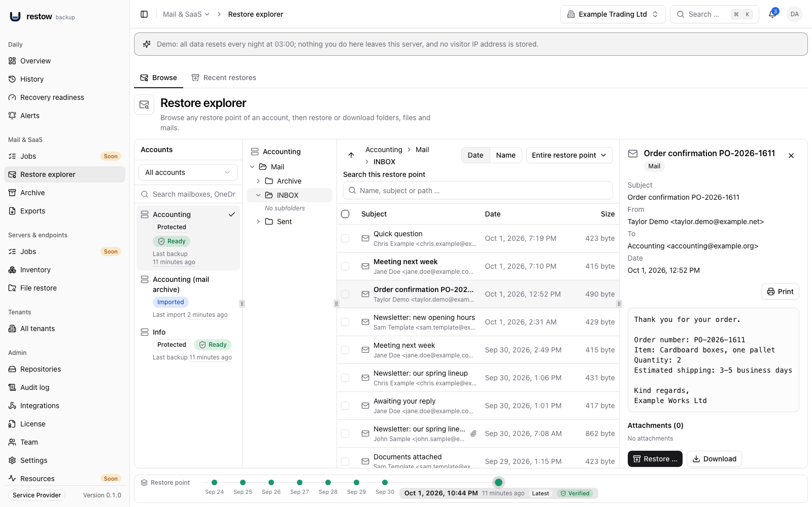
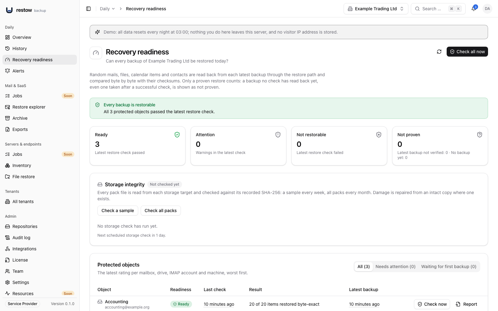
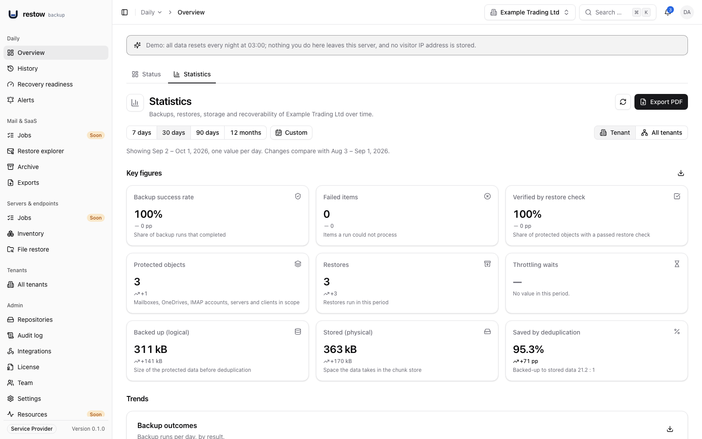
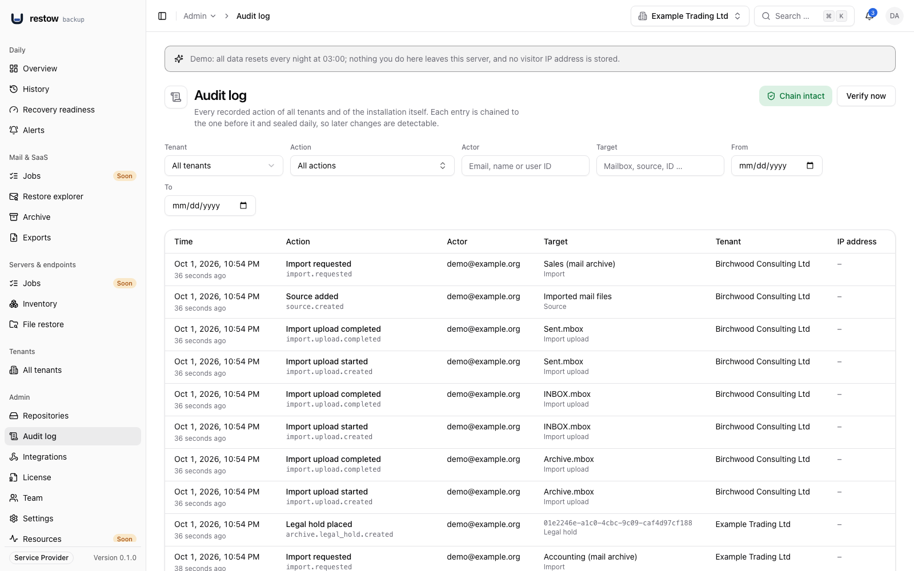
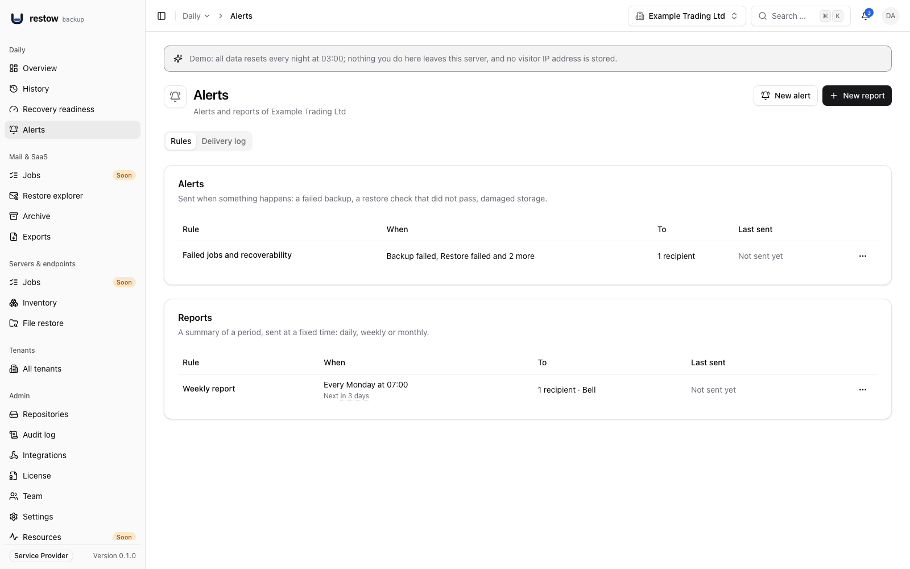
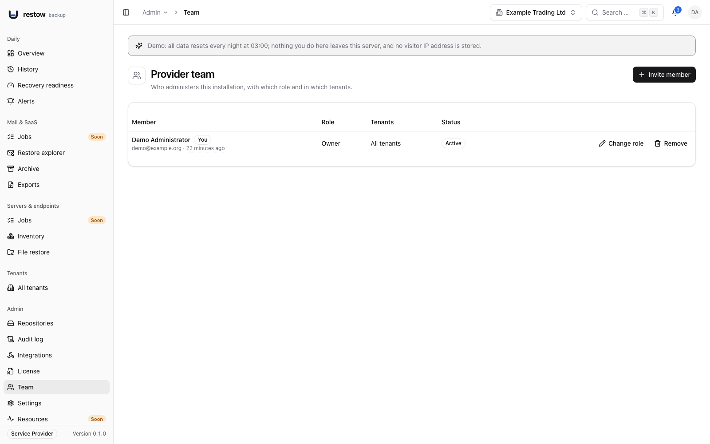

# Restow

**Restow. Backup you can prove is restorable.**

Self-hosted backup and archive for Microsoft 365 and IMAP, with endpoint backup
for Linux and macOS. Restow backs up Exchange Online mail, calendars and
contacts, OneDrive, any IMAP mailbox and your servers and clients to storage you
control, and every week reads a sample of each backup back through the restore
path and compares it with the recorded hashes. A backup only counts as
restorable once it has been read back.

**Status: beta (0.3.2).** Run it alongside your
existing backups, not as your only one, until you have verified restores
against your own data. Microsoft 365 backup and restore have been tested
against a simulated Graph API, never against a real Microsoft 365 tenant. What
works and what does not yet is in [CHANGELOG.md](CHANGELOG.md), especially its
Known Issues.

[Website](https://restowbackup.com) · [Documentation](https://docs.restowbackup.com) ·
[Live demo](https://demo.restowbackup.com) · [Changelog](CHANGELOG.md) ·
[Updating](docs/UPDATING.md)



## What it does

- **Backup** of Exchange Online (mail, calendar, contacts) and OneDrive through
  Microsoft Graph, incremental via delta queries, and of any IMAP mailbox.
  Graph is the only Microsoft interface Restow uses; Exchange Web Services, which
  Microsoft switched off for Exchange Online on 1 October 2026, are not.
- **Endpoint backup** of servers and clients with the Restow agent and restic:
  Linux and macOS agents (Windows is planned), installed root-owned and updated
  only with releases the maintainer signed, append-only so an agent can add
  backups but never delete or overwrite one, with retention decided by the
  server and a storage budget per machine and per tenant. Hooks run only where
  root on the machine allowed them. Restores go into a new folder, never over
  existing files. A machine backs up only once it is in a backup job: the
  inventory marks every machine without one ("Without backup") and offers to
  create a job for it or add it to an existing one. Servers back up their
  application data (`/opt`, `/usr/local`, `/var/lib`, `/var/backups`) besides
  `/etc`, `/home` and `/srv` by default, and every machine can be assigned to a
  person of the directory. Included in the Community edition.
- **Proxmox VE (preview):** VMs and containers on Proxmox VE 8.4 and newer
  through the Backup Provider API. VM disks are read over NBD with dirty
  bitmaps, so after the first run only changed blocks are uploaded; containers
  go through restic. Restores create a new VM or container. See
  [docs/PVE.md](docs/PVE.md).
- **Backup jobs:** one job covers many mailboxes or machines with one schedule,
  one set of folders and one retention, with per-member overrides. "Run now" on
  machines shows the request as queued until the agent picks it up at its next
  check-in.
- **Restore** of a single mail, a folder, a file, a file version or a whole
  account, next to the original, never over it; or as a ZIP download. People
  with the role "user" restore only their own mailbox and OneDrive. File restore
  lists the machines with their restore points on one timeline by day and a
  jump to any date; mailboxes and OneDrive are restored in the restore explorer.
- **Restore checks:** every week a sample of every backup is read back through
  the restore path and compared with the recorded hashes; the result is shown
  per mailbox, OneDrive and machine as recovery readiness. The checks do not
  restore into a Microsoft 365 or IMAP target.
- **Archive:** Exchange Online journal mail (Business and Service Provider) and
  imported mail files go into an append-only store with a SHA-256 hash chain,
  chain verification and search over subject, extracted text and addresses (not
  attachments). Business adds enforced retention (fixed at 8 years in 0.3.0) and
  legal hold, designed for GoBD-compliant use (not certified). Continuous
  IMAP and Graph archive sync are not part of 0.3.0. On local and NFS
  targets the archive's immutability is enforced by the application only, and on
  S3 with Object Lock 0.3.0 locks the archive item records but not the packs
  that hold the message content; see Known Issues in the changelog.
- **Import and export of mail files:** bring a legacy mailbox in from EML, MSG, MBOX,
  ZIP or a MailStore export folder (chunked, resumable, encrypted upload or a
  server-side import folder), browse and restore it like any mailbox, and optionally
  archive it. Export backed-up, imported or archived mail as EML in a ZIP or as MBOX,
  with checksums and an expiring download link.
- **Encryption:** AES-256-GCM per chunk with a separate key per tenant, before
  anything leaves the server. Deduplication stays within a tenant. One master key
  (`RESTOW_MASTER_KEY`) wraps every tenant key: whoever holds it and can read the
  storage can decrypt it, so keep it offline and apart from the storage.
- **Storage you choose:** repositories on local disk, S3-compatible object
  storage or NFS, with a copy repository next to the primary, promotion of a copy
  and replacement of the primary without losing access to existing backups (menu:
  Repositories). The installation's default repository is set in the web
  interface (or the environment); tenants on it stay separated by their own
  prefix and key. NFS shares are mounted from the web
  interface through the opt-in mounter container (Installation › Network shares,
  [docs/MOUNTS.md](docs/MOUNTS.md)).
- **Multi-tenant** for IT service providers (Service Provider edition), with a
  REST API (OpenAPI) and webhooks for RMM and PSA tools. The other editions run
  one organisation.
- **Alerts and reports:** rules that send an e-mail, a bell entry or a webhook
  (signed JSON, Discord, Slack or Microsoft Teams) when a backup fails, is
  overdue for its schedule or a restore check does not pass; warnings name the
  items that were not backed up and can be acknowledged. Notification mail goes
  out through SMTP, Microsoft 365 or Google Workspace. Business adds a daily,
  weekly or monthly summary report; every channel has a delivery log. The Overview,
  with its tabs Status and Statistics (CSV and PDF, always the active tenant),
  shows the state at a glance; the statistics of all tenants have a page of their
  own under Installation (Service Provider).
- **Audit log:** reads and restores of user data and administrative changes are
  recorded in a hash-chained, tamper-evident log in every edition and sealed
  daily. The viewer, with filter and chain verification, is a Business feature.
- **Standalone restore:** `restow-restore` restores from the chunk store and the
  keys alone, without a running Restow server or database.
- **Updates from the web interface:** the opt-in updater installs signed releases
  with a database backup first and an automatic rollback, starts with one
  command and keeps itself current after every signed update. A Community
  installation switches to the full build from Installation › Edition.
- **Built for daily work:** right-click or ⋯ on any table row for its actions,
  multi-selection to put several machines or mailboxes into a new job, full-width
  tables, German and English.

Not included in 0.3.0: PST and OST import, PST and MSG export, a Windows agent,
continuous IMAP and Graph archive sync, SharePoint, Teams, Google Workspace and
public folders. The first backup of a large tenant can take days because
Microsoft throttles Graph; Restow shows that wait instead of hiding it.

## Screenshots

From the public demo, which runs the Service Provider edition with synthetic data
(the audit log viewer is a Business and Service Provider feature), unretouched.

| | |
| --- | --- |
|  |  |
| Restore explorer: browse a restore point, preview a mail, restore or download. | Recovery readiness: the latest restore check per mailbox and OneDrive. |
|  |  |
| Overview, Statistics tab: backups, restores, storage growth and checks over 30 days. | Audit log (Business and Service Provider): who did what, when, for whom; the chain is verifiable. |
|  |  |
| Alerts: who is told what, and when, by e-mail, bell or webhook, and scheduled reports. | Members: several administrators with roles in every edition and, with Service Provider, limited to chosen tenants. |

## How Restow is built

Restow is built by Lucas Flores, an IT systems engineer with 15 years of
experience in IT and the owner of a small managed service provider in
Bergisch Gladbach, Germany. He is an engineer, not a professional software
developer.

A large part of the code is written with AI assistance (Claude Code), steered
by that technical background: Exchange, Microsoft Graph, storage and running
backups for customers every day. For a backup product that is a real risk,
and it is treated as one:

- A feature is not done until its restore is tested automatically. The
  repository has more than 7,000 automated tests (Vitest across all packages and
  Go tests for the agent), including suites that run against a real PostgreSQL
  with Row Level Security, and restore tests that compare byte for byte. None of
  them has run against a real Microsoft 365 tenant yet.
- The release checklist requires a smoke check before a version is tagged (image build,
  migrations on a fresh and an upgraded database, backup and restore against a
  test tenant and a test IMAP server, standalone restore, image and dependency
  scans). The report is attached to every release; where a check was skipped, it
  says so.
- The storage format is open and documented ([docs/ARCHITECTURE.md](docs/ARCHITECTURE.md),
  in German), so your data never depends on Restow or its author.

## Tech stack

| Part | Technology |
| --- | --- |
| Language | TypeScript on Node.js 22, one pnpm monorepo |
| API | Hono, OpenAPI for the integration API |
| Authentication | better-auth: passkeys (WebAuthn), authenticator app (TOTP), organizations for tenants (sign-in with Microsoft is planned) |
| Web interface | React 19, Vite, TanStack Router and Query, shadcn/ui, Tailwind CSS v4, i18next (German and English) |
| Jobs | Separate worker and scheduler processes on pg-boss (queue in PostgreSQL, no Redis) |
| Database | PostgreSQL 16 with Row Level Security per tenant, Drizzle ORM and migrations |
| Microsoft 365 | Microsoft Graph only (delta queries, own throttling layer), MSAL for app authentication |
| IMAP and SMTP | imapflow, mailparser, smtp-server for journal receipt |
| Endpoint agent | Go with the standard library only, driving restic; Linux and macOS |
| Storage | Own chunk store: content-defined chunking, SHA-256, AES-256-GCM, pack files; local disk, S3-compatible, NFS |
| Delivery | Two builds of every release (full and Community), each an application image with the roles api, worker and scheduler (plus the optional, opt-in updater) and a web image with Caddy for TLS and the web interface; Docker Compose |
| Tests and checks | Vitest, Playwright, Go tests, Biome, TypeScript strict, gitleaks, `pnpm audit`, Trivy |

## Quickstart

### Requirements

Run Restow on a **dedicated Linux VM**, and put that VM on **other hardware than
the systems it backs up**: a backup that fails together with the host it
protects is no backup. Keep the backups **off-site** as well, preferably on
S3-compatible object storage with Object Lock; the default target, a Docker
volume on the VM itself, is meant for a first test. Running Restow natively,
without Docker, is not supported.

The install script checks the following before it changes anything. A failed
check stops it; a warning does not.

| What | Requirement | The installer |
| --- | --- | --- |
| Operating system | Debian 12 or 13; Ubuntu 22.04, 24.04 or 26.04 LTS | Stops on any other system. |
| Architecture | amd64 or arm64 | Stops on any other. |
| Machine | A dedicated VM. LXC, OpenVZ and other containers work on a best-effort basis only (in LXC, Docker needs nesting and keyctl, and some hosts still break it). | Stops inside Docker, Podman and WSL; warns in LXC, OpenVZ and other containers. |
| Memory | At least 4 GiB assigned to the VM, 8 GiB recommended (mail parsing helper processes use up to 512 MB each). | Counts what the system reports plus the memory the kernel reserves for kdump. Warns below 7 GiB (a VM with 8 GiB shows a little less), stops below 3 GiB. See [Memory on Proxmox and other hypervisors](#memory-on-proxmox-and-other-hypervisors). |
| Disk | At least 1 GiB free for `/opt/restow`; at least 10 GiB free for Docker's data directory (`/var/lib/docker` by default; images and database), 50 GiB or more recommended, because the backups go into a Docker volume there until you add another storage target. | Stops below 1 GiB for `/opt/restow` or below 10 GiB for Docker; warns below 50 GiB for Docker. On an LVM volume whose volume group has unused space it prints the command that grows it, see [Disk on Ubuntu with LVM](#disk-on-ubuntu-with-lvm). |
| Clock | Synchronised (NTP): certificates, signature checks and authenticator codes need the right time. | Warns if it is not. |
| Rights | root, or `sudo` | Stops without. |
| Tools | `curl`, `awk`, `sed`, `od`, `base64`, `tr`, `df` and `mktemp` | Stops if one is missing. |
| Docker | Installed by the script from Docker's apt repository when it is missing. Docker from snap is not supported. An installed Docker needs Engine 24.0 and Compose 2.20 or newer. | Stops on Docker from snap, on an older version, and when Docker is missing and packages that conflict with Docker's own are installed (for example `docker.io`, `containerd`, `runc`). |
| Outbound HTTPS | Port 443 to `github.com`, `ghcr.io`, `registry-1.docker.io`, `tuf-repo-cdn.sigstore.dev` (signature checks) and, when Docker is missing, `download.docker.com` | Stops if one does not answer. |
| Images | The images of the build and version you install can be pulled from `ghcr.io` without a login. | Asks the registry before it changes anything. Stops if an image is not public or does not exist (check `--version` and `--edition`). |
| Ports | 80 and 443 free on the host (the Caddy edge). [Behind a reverse proxy](#behind-a-reverse-proxy) (`--behind-proxy`, from 0.2.0) only the one port the proxy forwards to: 443, or 80 for the plain HTTP hop. A journal receiver for Exchange Online (Business and Service Provider) needs one more port, usually 25; you set it up after the installation. | Stops if 80 or 443 is in use (behind a reverse proxy: if the one port it needs is). Does not check the journal port. |
| Domain | Public installation: a domain whose A or AAAA record points at the server, with ports 80 and 443 reachable from the internet; Caddy gets the Let's Encrypt certificate there. Not needed with `--local` (evaluation only). Behind a reverse proxy: the name your proxy serves; this host needs no DNS record of its own and no inbound port from the internet. | Warns if the domain does not resolve to this host (not behind a reverse proxy: the name points at the proxy, so DNS is not checked). |

#### Memory on Proxmox and other hypervisors

A VM sees less memory than it is given: the kernel and the firmware keep some,
and where kdump (crash dumps) is enabled, as it can be on Ubuntu, the kernel
sets aside another 320 to 512 MB for a crash kernel (`crashkernel=` on the
kernel command line; Ubuntu's default is 320 MB for a machine with 2 to 4 GiB
and 512 MB for 4 to 32 GiB). `free` does not count that memory. The installer
adds it back before it judges the memory, so a VM with 4 GiB, which can show as
little as 3.3 GiB, only gets a warning and the installation goes on.

- Assign at least 4 GiB to the VM, 8 GiB recommended.
- With ballooning (Proxmox VE: a "Minimum memory" below "Memory"), the VM can
  be left with less than you assigned. Set "Minimum memory" equal to "Memory".
- After you change the memory, shut the VM down and start it again. A reboot
  from inside the VM does not apply the change.
- Check inside the VM: `free -h` shows what the system sees, and
  `cat /sys/kernel/kexec_crash_size` the bytes reserved for kdump (`0` or no
  such file: nothing is reserved; newer kernels also offer
  `/sys/kernel/kexec/crash_size`).

#### Disk on Ubuntu with LVM

Ubuntu Server's installer sets up LVM and often makes the root logical volume
smaller than the disk: on a 30 GB disk, `/` can be 15 GB and the rest of the
volume group stays unused. Docker's data directory (`/var/lib/docker`) lives on
`/`, so the disk check can stop the installer on a VM whose disk is large
enough. Check how much of the volume group is unused (column `VFree`), then
grow the root volume and its file system in one step:

```sh
sudo vgs
sudo lvextend -r -l +100%FREE /dev/ubuntu-vg/ubuntu-lv
```

`ubuntu-vg` and `ubuntu-lv` are Ubuntu's default names; `sudo lvs` shows yours,
and when the installer finds unused space it prints this command with the
right names. If `VFree` is 0, there is nothing to extend: the disk itself has to
be larger.

### Install with the script (recommended)

Every release carries `install.sh`, which sets up the release stack on such a
VM in `/opt/restow`. It checks the machine (operating system, architecture,
virtualization, memory, disk, ports 80 and 443, outbound HTTPS, clock, the
domain's DNS record, that the images can be pulled without a login, an earlier
installation), installs Docker Engine and the Compose plugin from Docker's
signed apt repository if Docker is missing, downloads `docker-compose.yml` and
`env.example` of the release and checks them against the release's signed
`SHA256SUMS`, writes `.env` (mode 0600) with freshly generated secrets, checks
the cosign signatures of the two images and starts the stack. Download it,
check it, then run it:

```sh
curl -fsSLO https://github.com/restow-backup/restow/releases/download/v0.3.2/install.sh
curl -fsSLO https://github.com/restow-backup/restow/releases/download/v0.3.2/install.sh.sha256
sha256sum -c install.sh.sha256
sudo bash install.sh
```

Run without options on a terminal, it starts with a short introduction (what it
will do, about 10 to 20 minutes, what you need) and asks how Restow is reached:
**1** public, with its own certificate (a domain that points at the server,
ports 80 and 443 open to the internet), **2** behind a reverse proxy you already
run (Nginx Proxy Manager, Traefik, Caddy, ...), **3** a local evaluation (the
same as `--local`). It then asks for the domain (for option 2 also for the
proxy's address) and the build (full or Community, see step 2 below), shows its
plan, and before it starts the stack shows `RESTOW_MASTER_KEY` once: **store it
offline then**, it is never shown again and not written to the log. At the end it
waits until the api is healthy, reads the one-time setup token from the api's log
and prints, as its last lines, a box with the address to open and the token. The
token goes to the terminal only, never to `/var/log/restow-install.log`; a run
whose output is collected (no terminal) prints how to read it instead. The setup
wizard first asks for the language, then for the token, which stays valid until
the setup is finished. Read it again on the server with
`cd /opt/restow && sudo docker compose logs api | grep 'SETUP TOKEN'`. (The 0.1.0
script asks only for the domain and the build, and prints the setup URL and that
command.)

`install.sh.sha256` only proves that the download is complete. To check that
the script is the one the release workflow published, verify the signed
checksum list with [cosign](https://docs.sigstore.dev/cosign/) first:

```sh
curl -fsSLO https://github.com/restow-backup/restow/releases/download/v0.3.2/SHA256SUMS
curl -fsSLO https://github.com/restow-backup/restow/releases/download/v0.3.2/SHA256SUMS.sigstore.json
cosign verify-blob SHA256SUMS --bundle SHA256SUMS.sigstore.json \
  --certificate-identity https://github.com/restow-backup/restow/.github/workflows/release.yml@refs/tags/v0.3.2 \
  --certificate-oidc-issuer https://token.actions.githubusercontent.com
sha256sum -c --ignore-missing SHA256SUMS
```

For an unattended installation pass the answers as options; the master key is
then not shown, so copy it from `/opt/restow/.env` to an offline place right
away:

```sh
sudo bash install.sh --non-interactive --domain backup.example.com --edition community
```

`bash install.sh --help` lists every option and the exit codes: `--domain`,
`--edition full|community` (default full), `--version`, `--dir` (default
`/opt/restow`), `--yes` or `--non-interactive`, `--with-updater` (the opt-in
updater stays off unless you ask for it, see [docs/UPDATING.md](docs/UPDATING.md)),
`--with-mounter` (from 0.3.0: the opt-in mounter for NFS network shares, off
unless you ask for it, see [docs/MOUNTS.md](docs/MOUNTS.md)),
`--local` (an evaluation without a public domain: the edge serves
`https://localhost` or an internal name such as `restow.internal` over HTTPS
with a certificate from Caddy's own authority, browsers warn about it and
passkeys are not offered; `--http-local` is a deprecated name for it),
`--behind-proxy`, `--proxy-ip` and `--proxy-hop` (from 0.2.0, see
[Behind a reverse proxy](#behind-a-reverse-proxy) below),
`--dry-run` (checks only, prints what it would do) and `--skip-signature-check`
(for tests and unsigned mirrors only, never for production). Its log is
`/var/log/restow-install.log`, without secrets.

Running the script again is safe: it finds the installation, never changes
`.env`, a secret or data, checks the images named in `.env` and makes sure the
stack runs. It refuses to start when Docker holds data of an earlier
installation without its `.env`. It never updates an installation (see
[Updating](#updating)) and has no uninstall (see
[Removing Restow](#removing-restow)).

As a shortcut, the script also runs straight from the download:

```sh
curl -fsSL https://github.com/restow-backup/restow/releases/download/v0.3.2/install.sh | sudo bash
```

That runs whatever arrives without your own check of the script first. It still
checks the signatures of everything it downloads afterwards, but prefer the
steps above on a production server.

#### Behind a reverse proxy

If a reverse proxy you already run holds your public names and certificates,
Restow needs no public DNS record on its host, no inbound port 80 or 443 from the
internet and no certificate of its own. The proxy terminates TLS and forwards to
the Caddy edge on the Restow host, **encrypted by default**: the edge serves
HTTPS with a certificate from Caddy's own authority. From 0.2.0:

```sh
sudo bash install.sh --behind-proxy --domain backup.example.com --proxy-ip 192.168.1.20
```

`--proxy-ip` is the address of the proxy itself as the Restow host sees it (repeat
the option or separate several with spaces; a bare address gets `/32` or `/128`),
not your network: Restow believes the client address these peers report in
`X-Forwarded-For`. It is required with `--non-interactive`. The script checks that
port 443 is free (port 80 is not needed), does not look at DNS, and writes to
`.env`:

```sh
RESTOW_APP_DOMAIN=backup.example.com
RESTOW_PUBLIC_URL=https://backup.example.com
RESTOW_EDGE_TLS=internal
RESTOW_EDGE_TRUSTED_PROXIES=192.168.1.20/32
RESTOW_HTTP_PORT=127.0.0.1:
```

HSTS stays off (it belongs to the proxy), and port 80 is published on the
loopback only. The script copies the root certificate of the edge's own
authority to `/opt/restow/edge-root-ca.crt`, to verify the edge with. In the
proxy: **scheme `https`, the Restow host's address, port `443` (not 80, and never
3000, which is the api on the loopback)**, response buffering off, and for nginx-based
proxies such as Nginx Proxy Manager, under Advanced:

```nginx
proxy_ssl_server_name on;
proxy_ssl_name $host;
proxy_buffering off;
```

(`proxy_buffering off` lets the live updates, server-sent events, through.)
Docker publishes port 443 on every interface and `ufw` rules do not cover it; to
let only the proxy in, publish it on one address (`RESTOW_HTTPS_PORT=192.168.1.50:443`)
or use the `DOCKER-USER` chain. The settings of Traefik and Caddy as the proxy,
the firewall rule, the plain HTTP hop (`--proxy-hop http`, **not encrypted**, for
a proxy on the same host or in an isolated network, any release) and the manual
way for an installation made with 0.1.0 (`RESTOW_APP_DOMAIN=http://...`, a
LAN-only unencrypted hop) are in the documentation:
[Behind a reverse proxy](https://docs.restowbackup.com/administrators/get-started/#behind-a-reverse-proxy).

### Install by hand with Docker Compose

On any Linux host with Docker and Docker Compose v2 (the steps the script
automates). For a local evaluation on your own machine, see the note after
step 2.

1. **Get the release stack.** It runs the published, signed images and builds
   nothing. Download `docker-compose.yml` and `env.example` from the
   [release assets](https://github.com/restow-backup/restow/releases/tag/v0.3.2)
   into an empty directory and run `cp env.example .env`, or clone the tag and
   work in `deploy/release/`:

   ```sh
   git clone --branch v0.3.2 https://github.com/restow-backup/restow.git
   cd restow/deploy/release
   cp .env.example .env
   ```

2. **Fill in `.env`.** The comments in the file say how; the sections marked
   optional can stay empty. At minimum the two images of one build, either the
   full build (`RESTOW_IMAGE=ghcr.io/restow-backup/restow:0.3.2`,
   `RESTOW_WEB_IMAGE=ghcr.io/restow-backup/restow-web:0.3.2`; Business and
   Service Provider stay locked until a license key is installed) or the
   Community build (`ghcr.io/restow-backup/restow-community:0.3.2`,
   `ghcr.io/restow-backup/restow-web-community:0.3.2`; the Apache-2.0 core
   alone), then `POSTGRES_PASSWORD`, the three database connection strings
   (`DATABASE_MIGRATION_URL`, `DATABASE_URL`, `DATABASE_PROVIDER_URL`),
   `RESTOW_MASTER_KEY`, `BETTER_AUTH_SECRET`, `RESTOW_PUBLIC_URL` and
   `RESTOW_APP_DOMAIN` (the compose file refuses to start without it). Generate
   secrets with:

   ```sh
   openssl rand -base64 32   # RESTOW_MASTER_KEY, BETTER_AUTH_SECRET
   openssl rand -hex 16      # each database password
   ```

   **Back up `RESTOW_MASTER_KEY` offline before the first real backup.** It
   wraps every tenant's key; without it no backup can ever be read again.

   *Local evaluation:* set `RESTOW_APP_DOMAIN=localhost` and
   `RESTOW_PUBLIC_URL=https://localhost`. Caddy then serves `https://localhost`
   with a certificate from its own local certificate authority, so your browser
   shows a warning until you trust it, and ports 80 and 443 on the machine must
   be free. Choose the local operating mode in the setup wizard; passkeys are
   not offered there, so the first administrator signs in with a password and
   an authenticator app.

3. **Start the stack**

   ```sh
   docker compose up -d
   ```

   This pulls the images and starts PostgreSQL, the three Restow roles and
   Caddy. The `api` container applies the database migrations before it serves.

4. **Check it and open the setup wizard**

   ```sh
   curl -fsS http://127.0.0.1:3000/healthz
   ```

   Open `RESTOW_PUBLIC_URL` in a browser. The setup wizard first asks for the
   language (English or Deutsch, preselected from the browser), then for the
   one-time setup token, which proves that you operate the server and which only
   someone with access to it can read: the `api` container prints it to its log
   at every start until the setup is complete.

   ```sh
   docker compose logs api | grep 'SETUP TOKEN'
   ```

   Then it shows the operator notice, chooses the operating mode, asks for the
   name of your organisation (it becomes your own organisation, the place for
   your own backups), creates the first administrator (passkey first) and sets
   up notification mail, which you can skip and set up later under Installation,
   Settings, Mail. Then add a Microsoft 365 tenant or an IMAP mailbox as
   a source. For an unattended
   installation, set `RESTOW_SETUP_TOKEN` in `.env` instead (see
   `.env.example`).

To build the images from source instead of pulling them, see
[CONTRIBUTING.md](CONTRIBUTING.md). The release images can be verified with
cosign; see [deploy/release](deploy/release/README.md). The operator guides, including the
Entra app registration for Microsoft 365, are in the
[documentation](https://docs.restowbackup.com/administrators/get-started/); the
release pipeline and its smoke checks are described in [docs/CI.md](docs/CI.md).

## Removing Restow

The install script has no uninstall on purpose: removing an installation can
destroy backups. To remove one by hand, in its directory (`/opt/restow` for an
installation made by the script):

```sh
cd /opt/restow
sudo docker compose --profile updater down
```

This stops and removes the containers. The database, the local chunk store,
Caddy's certificates and the updater's database dumps stay in their Docker
volumes (`restow_pgdata`, `restow_restow-data`, `restow_caddy-data`, ...), and
`.env` stays in place. Only when you are sure that no backup in them is still
needed:

```sh
sudo docker compose --profile updater down --volumes   # deletes the database and the local chunk store
cd / && sudo rm -r /opt/restow                          # .env holds RESTOW_MASTER_KEY
```

Keep an offline copy of `RESTOW_MASTER_KEY` as long as backups on other
storage (S3, NFS) may still be needed: `restow-restore` reads them with the
key alone. Those backups are not deleted by the steps above; remove them in the
storage itself. Docker stays installed.

## Updating

The Upgrade Notes of every release state whether the update needs only a new
image, runs database migrations (automatically, at start) or needs manual steps,
how long it takes and how to roll back. The steps, the backup before the update
and the rollback are in [docs/UPDATING.md](docs/UPDATING.md); release notes
follow [docs/releases/TEMPLATE.md](docs/releases/TEMPLATE.md). Internal builds
before 0.1.0 cannot be upgraded; see Breaking Changes in the changelog.

## Recovering administrator access

If the last owner of an installation has lost their passkey, authenticator app
or password, recover the access on the server, in the `api` container:

```sh
docker compose exec api restow admin list
docker compose exec api restow admin recover --email owner@example.com
```

`admin recover` asks for confirmation and for a new password, then removes the
owner's authenticator app and passkeys and ends all their sessions. The owner
signs in with the new password and sets up an authenticator app again before
anything else. The recovery is recorded in the audit log. It works for owners
only; an owner resets every other administrator in the web interface
(Installation › Members, *Reset access*: password, passkeys and authenticator
app are removed, the sessions end, and the administrator gets a new link to
choose a password).
`docker compose exec api restow help` lists the options.

## Editions

All editions are self-hosted, have no mailbox limit and never limit restore.

| Edition | For | Price |
| --- | --- | --- |
| **Community** | One organisation: every backup source and restore function, endpoint backup, mail import and export, the archive (search, hash chain), alerts, dashboard and statistics, the REST API, tenant members with self-service restore. Several provider administrators with roles (owner, administrator, technician, read only), each with every tenant. Apache-2.0, no license key. | Free |
| **Business** | Adds the archive's GoBD layer (journal receiver, enforced retention, legal hold), scheduled summary reports and the audit log viewer. CSV and PDF export of the audit log is planned. Still one organisation. | One-time purchase |
| **Service Provider** | Adds multiple tenants, team members limited to chosen tenants, the cross-tenant API and the provider dashboard. | One-time purchase |

Every release comes in two builds. The full images (`restow`, `restow-web`)
contain the Business and Service Provider modules, which an offline-verified
license key (Ed25519, no phone-home) unlocks at runtime under Installation › License;
without a key they run as Community. The Community images (`restow-community`,
`restow-web-community`) contain the Apache-2.0 core alone and no license
screen. Both use the same database, so you can switch by changing the two image
lines in `.env`; a Community installation also offers the switch to the full build
under Installation › Edition, done by the opt-in updater when it runs (the full images
of the same version, signature-checked, with a backup and a rollback), and keeps a
license key entered there until the full build checks and applies it. The switch
goes one way: from Community to the full build. Mailbox and tenant counts are an honour rule of the license
terms, not a limit in the software. Prices and terms:
[restowbackup.com](https://restowbackup.com).

## Development

Building from source, running the development servers and the checks are
described in [CONTRIBUTING.md](CONTRIBUTING.md).

Documentation lives in two places. The operator guides are at
[docs.restowbackup.com](https://docs.restowbackup.com). The files in [docs/](docs/)
are for maintainers and contributors: the design documents
[ARCHITECTURE](docs/ARCHITECTURE.md), [STACK](docs/STACK.md),
[MICROSOFT](docs/MICROSOFT.md), [IMAP](docs/IMAP.md), [ARCHIVE](docs/ARCHIVE.md),
[IMPORT](docs/IMPORT.md), [AGENT](docs/AGENT.md), [ENTRA-SETUP](docs/ENTRA-SETUP.md)
and [TESTING](docs/TESTING.md) are written in German; [STORAGE](docs/STORAGE.md),
[UPDATING](docs/UPDATING.md) and [CI](docs/CI.md) are in English. Code, commits,
this README, the changelog and the public documentation are in English.

## Contributing and security

- Contributions are welcome; please read [CONTRIBUTING.md](CONTRIBUTING.md).
  A contributor license agreement ([CLA.md](CLA.md)) is required before the
  first pull request is merged.
- Report vulnerabilities privately as described in [SECURITY.md](SECURITY.md),
  never in a public issue.

## License

The Restow core is published on GitHub under the [Apache License 2.0](LICENSE).
The Business and Service Provider modules in `ee/` are licensed under the
[Restow license terms](https://restowbackup.com/en/license-terms/).

Made by [IT Systeme Flores UG (haftungsbeschränkt)](https://it-flores.de),
Bergisch Gladbach, Germany.
